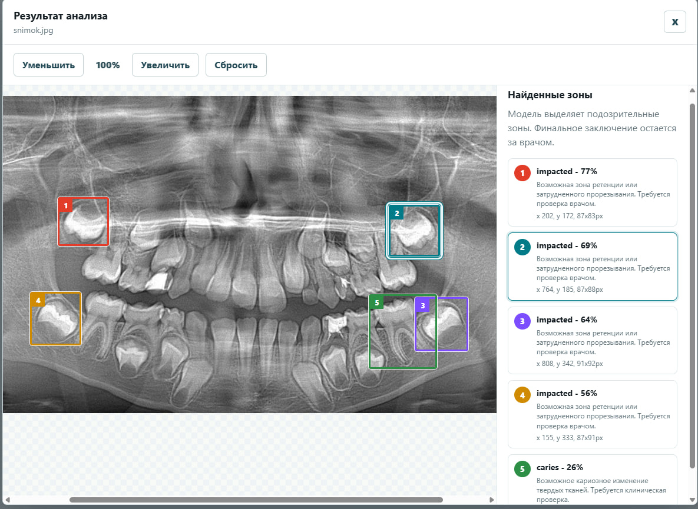

# DentVision

DentVision - учебное веб-приложение для предварительного анализа стоматологических
рентген-снимков. Врач загружает снимок пациента, backend отправляет его в ML-сервис,
а интерфейс показывает найденные зоны на изображении и список результатов справа.



## Что умеет приложение

- создание, редактирование и удаление пациентов;
- загрузка панорамных/рентген-снимков;
- запуск анализа снимка через отдельный Python ML service;
- отображение найденных зон на снимке цветными рамками;
- масштабирование изображения в окне результата;
- сохранение jobs и results в PostgreSQL;

## Архитектура

```text
frontend React/Vite
        |
        v
backend Go + chi + JWT
        |
        +--> PostgreSQL
        |
        v
ml-service FastAPI + Ultralytics YOLO
```

Сервисы:

- `frontend` - интерфейс врача, порт `5173`;
- `backend` - REST API на Go, порт `8080`;
- `ml-service` - FastAPI сервис анализа снимков, порт `8001` на хосте;
- `postgres` - база данных;
- `pgadmin` - удобный просмотр базы, порт `5050`, необязателен для демо.

## Требования

Для запуска достаточно сервера примерно:

- 2 vCPU;
- 4 GB RAM;
- 40 GB SSD;
- 200 Mbps.

Важно: обучение модели на таком сервере делать не нужно. Сервер рассчитан на запуск
готового приложения и inference уже подготовленной модели.

